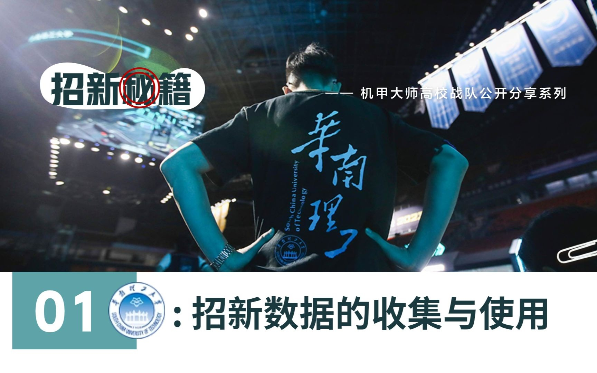
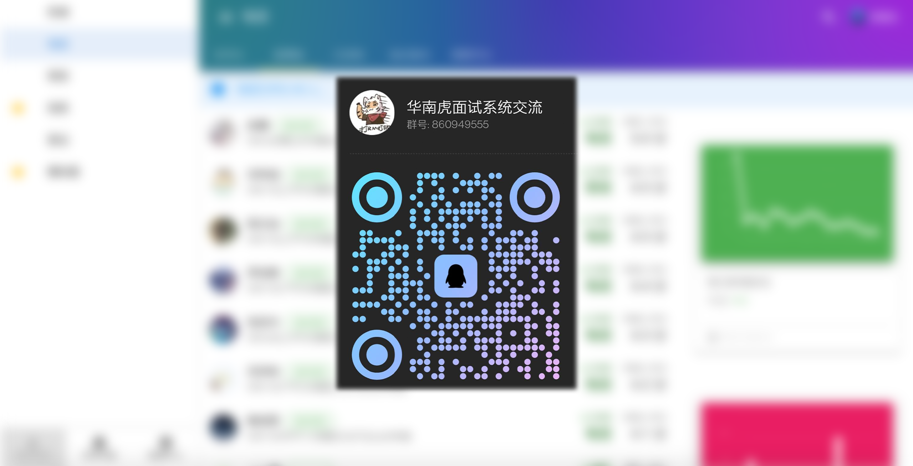

# 华南虎面试系统后端

使用说明和技术实现见Wiki

## 前端请访问 [HR_Frontend](https://github.com/scutrobotlab/HR_Frontend)

## 官方 Demo

面试者端（使用微信登录）

https://hr-demo.scutbot.cn/joinus

管理员端（直接超管登录）

https://hr-demo.scutbot.cn/admin

所有人都有超级管理员权限，不建议在报名页面填写真实信息。如果已经填写的信息，可以自行前往管理员端删除。

## 软件功能介绍

队伍在每年招新季都需要收集面试者的个人信息。但随着报名者的不断增加，传统的问卷收集或Word文档的模式已经很难满足队伍的需求。于是，队伍根据自身需求定制了一套面试系统。该系统具有以下功能：

- 面试者端
    - 收集报名者信息
    - 协调面试时间
    - 公布录取结果
    - 参考题库和学习建议
- 管理员端
    - 面试者信息查看
    - 面试者评分和评价
    - 面试者评价统计
    - 查看面试者题库反馈
    - 面试教室编排
    - 自动发送短信
    - 面试日程可视化
    - 修改系统配置

## 软件效果展示

[华南虎面试系统介绍演示_哔哩哔哩_bilibili](https://www.bilibili.com/video/BV1DC4y1f7Fh)

截止2023年9月21日 播放量达到 8700 位列“华工机器人实验室”B站账号第三名

[RMU 2024  招新专题课程沙龙 01：华南理工大学 招新数据的收集与使用_哔哩哔哩_bilibili](https://www.bilibili.com/video/BV1Gh4y1Y73x)

**RoboMaster赛务君** 邀请华南虎直播的招新课程沙龙

## 官方交流群

## [使用说明 Wiki](https://github.com/scutrobotlab/HR_Go/wiki/使用说明)

## [技术实现 Wiki](https://github.com/scutrobotlab/HR_Go/wiki/技术实现)

## 迭代历程

### 第一版 recruitment

2019年3月7日 启动项目

2019年9月8日 停止维护

### 第二版 HR_LV

2020年5月30日 启动项目

2022年10月22日 停止维护

### 第三版 HR_Go, HR_Frontend

2023年6月29日 启动项目

## 幕后人员

### 开发

杨泽霖 @BigeYoung

杨中得 @M3chD09

常霆钰 @Summer-lights

### 运维

林钜聪 @dnomd343

罗棨文 @WintBit

陈俊达 @ChenJD

### 技术指导

胡玮文 @huww

苏永怡 @Sution

### 软件测试

仅包括2023年8月底测试期

常霆钰、罗棨文、陈俊达、谢函瀚、盛鸣芝、蔡国斌、杨泽霖、陈钟煜、张华铨、林健雄、邓士博、丁志豪、王乐凡、赵宇轩、欧步青、魏小菲、余乐贤、孟杨、郑鑫、曾熙朗、许志成、张起宁、余俊晖、刘渊、林瑞创、凌彩兰、唐博滔、陈俊标、吴卓沅

## TODO List (RoadMap)

- [x] 优化部分为了ORM而ORM写出的性能较差的数据库查询
- [ ] 允许使用用户名密码登录，不依赖华南虎统一认证系统
- [ ] 部分高频操作加入缓存，后续计划引入Redis
- [ ] 教室分配功能尚不支持图形化界面
- [ ] 面试时间功能图形化支持不完备，有时需要管理员修改数据库
- [ ] 最终结果不支持导出，往往需要管理员手动写SQL
- [x] 数据库自动创建和支持迁移
